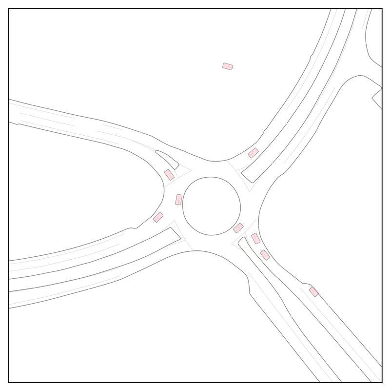
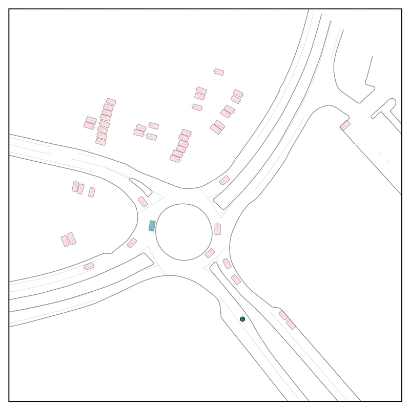
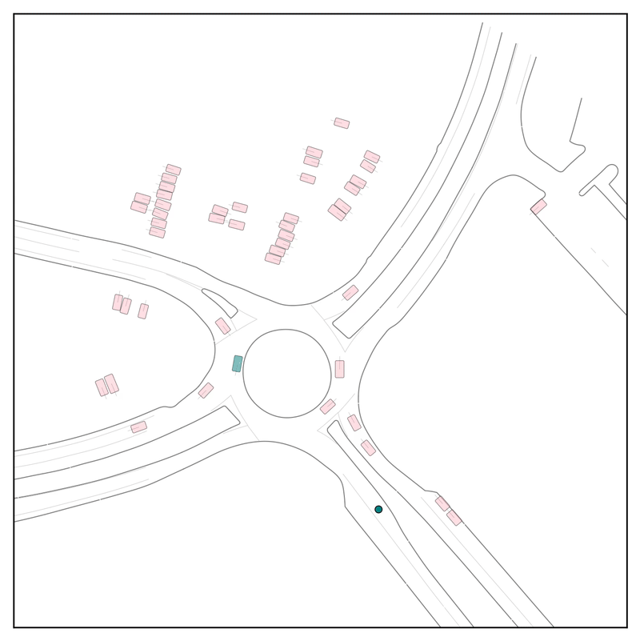
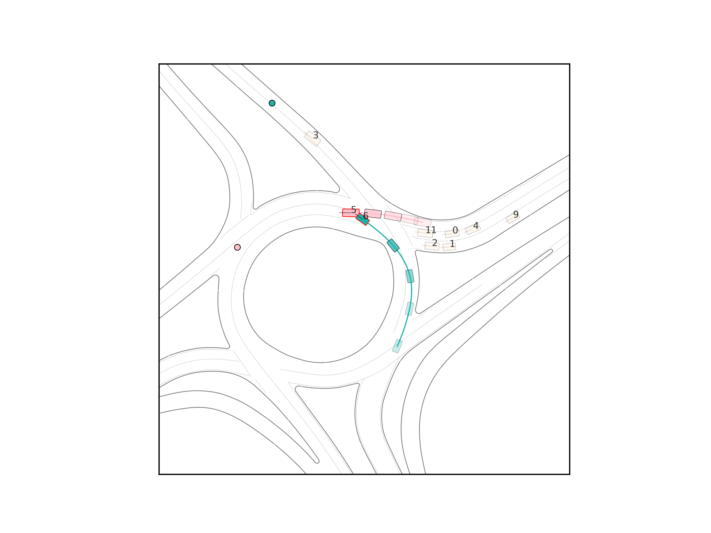

# Froked from the Official Repository for CtRL-Sim (CoRL 2024)
# Resutls with a roundabout scenario

  
  
  

Original Scenario from Waymo Open Motion Dataset, with negative tilting and positive tilting respectively. 

