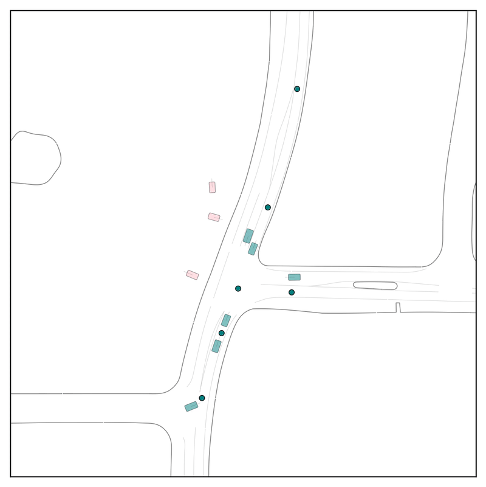

# Froked from the Official Repository for CtRL-Sim (CoRL 2024)
# Resutls of a roundabout scenario

  
  
  

Original Scenario from Waymo Open Motion Dataset, with negative tilting and positive tilting respectively. The agent in green is controlled by CtRL-Sim and the others are in log-replay. 

# Results of a T-Intersection scenaro

  
  
  

Original scenario at left and negative tilting for both in right. 

# Other results

